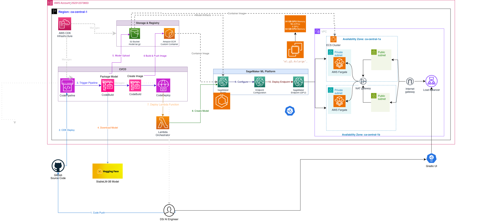

# LLM MLOps System on AWS (Custom Hugging Face Model)

A **end-to-end LLM MLOps system** built on AWS using a **custom Hugging Face Large Language Model (StableLM-3B)** — without Amazon Bedrock.

This platform demonstrates how to **download, package, deploy, host, and operate an LLM model in production** using AWS-native services and MLOps best practices.

This is **not a notebook demo**.  
It is a **real, deployable LLM system** designed for scalability, and reliability.

---

## 🏗️ System Architecture



## 🚀 What This System Does

**System Summary**

This platform:
- Downloads a Hugging Face LLM (StableLM-3B)
- Packages and uploads the model to Amazon S3 Bucket
- Builds a custom GPU inference Docker image
- Pushes the image to Amazon ECR
- Deploys the model to Amazon SageMaker
- Hosts a real-time inference endpoint
- Exposes an API for LLM inference
- (Optionally) supports UI-based interaction and monitoring

---

## 🧠 Why This Matters

This architecture is directly applicable to:

- Custom LLM hosting (no Bedrock dependency, using BYOC approach!)
- RAG systems using private data
- Enterprise AI platforms with governance requirements
- Cost-controlled LLM inference on AWS
- Teams that need **full control** over models, images, and deployment

---

**High-level flow:**
- Hugging Face → Local / CLI
- Model artifacts → Amazon S3
- Inference container → Amazon ECR
- Hosting → Amazon SageMaker Endpoint
- Clients → REST API / UI

---

## 🔄 Benefits

### 1. Model Download (Hugging Face)

- Hugging Face CLI is used to download the model locally
- Example model:
  - `stabilityai/stablelm-3b-4e1t`

```bash
hf auth login
hf download stabilityai/stablelm-3b-4e1t --local-dir stablelm-3b


